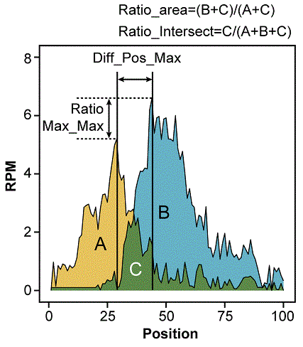

<!-- rmarkdown v1 -->
<!--
%\VignetteEngine{knitr::knitr}
%\VignetteIndexEntry{similaRpeak: similarity between two ChIP-Seq profiles}
-->


Metrics which estimate similarity between two ChIP-Seq profiles
====================================================================

Astrid Louise Deschenes, Elsa Bernatchez, Charles Joly Beauparlant, 
Fabien Claude Lamaze, Rawane Samb, Pascal Belleau and Arnaud Droit.

This package and the underlying similaRpeak code are distributed 
under the Artistic license 2.0. You are free to use and redistribute 
this software. 


## Quick Start

Enhancer regions found in the mouse embryonic stem cells thought to be 
important for the cell fate as being highly active and connected regions have
been selected (Whyte et al. 2013 & Dowen et al. 2014). Using Encyclopedia of 
DNA Elements (ENCODE) data (Dunham I et al. 2012), the epigenetic landscape 
overlap surrounding those enhancer regions at two histone 
post-transcriptional modifications linked to highly active enhancers H3K27ac 
(DCC accession: ENCFF000ASG) and H3K4me1 (DCC accession: ENCFF000ARY) for human
specie has been studied. 

First, the `similaRpeak` package nust be loaded.

```{r libraryLoad}
suppressMessages(library(similaRpeak))
```

A region, chr7:61968807-61969730, shows interesting profiles for both histones.
Let's load the data for this region.

```{r profiles, collapse=T}
load(system.file("extdata/chr7_profiles.RData", package = "similaRpeak"))

head(H3K27ac_chr7_profile, n=15)
head(H3K4me1_chr7_profile, n=15)
```

H3K27ac and H3K4me1 profiles have those shapes:

```{r graphProfiles, echo=FALSE, fig.align='center', fig.height=6 }
plot(H3K27ac_chr7_profile, type="l", col="blue", xlab="", ylab="", 
     ylim=c(0, 700), main="chr7:61968807-61969730")
par(new=TRUE)
plot(H3K4me1_chr7_profile, type="l", col="darkgreen", xlab="Position", 
     ylab="Coverage", ylim=c(0, 700))
legend("topleft", c("H3K27ac","H3K4me1"), cex=1.2, 
            col=c("blue","darkgreen"), lty=1)
```

The metrics are calculated using the `similarity` function which takes as 
arguments the two ChIP-Seq profiles vectors and the threshold values.

```{r metricCalculation}
metrics <- similarity(H3K27ac_chr7_profile, 
                            H3K4me1_chr7_profile, 
                            ratioAreaThreshold=5, 
                            ratioMaxMaxThreshold=2, 
                            ratioIntersectThreshold=5, 
                            ratioNormalizedIntersectThreshold=2,
                            diffPosMaxThresholdMinValue=10, 
                            diffPosMaxThresholdMaxDiff=100, 
                            diffPosMaxTolerance=0.01)
```

The `similarity` function returns a list which contains the general 
information about both ChIP-Seq profiles and a list of all four metrics. 

```{r metricReturn, collapse=T}
metrics
```

Each specific information can be directly accessed. Some examples:

```{r getInfo, collapse=T}
metrics$areaProfile1
metrics$areaProfile2
metrics$metrics$RATIO_INTERSECT
```

The **RATIO_INTERSECT** value of `r round(metrics$metrics$RATIO_INTERSECT, 2)` 
and the **RATIO_MAX_MAX** value of `r round(metrics$metrics$RATIO_MAX_MAX, 2)` 
are quite low. Both values can be explained by the large difference in 
coverage between profiles. Those values could be interpreted as two profiles 
with low level of similarity. However, the **RATIO_NORMALIZED_INTERSECT** of 
`r round(metrics$metrics$RATIO_NORMALIZED_INTERSECT, 2)` is much closer to 1. It 
could be a sign that the profiles, once normalized, are quite similar.
This hypothesis can be validated by looking at a graph of the normalized
profiles :

```{r graphProfilesNorm, echo=FALSE, fig.align='center', fig.height=6 }
plot(H3K27ac_chr7_profile*length(H3K27ac_chr7_profile)/sum(H3K27ac_chr7_profile,
        na.rm=T), type="l", col="blue", xlab="", ylab="", ylim=c(0, 3.5))
par(new=TRUE)
plot(H3K4me1_chr7_profile*length(H3K4me1_chr7_profile)/sum(H3K4me1_chr7_profile,
        na.rm=T), type="l", col="darkgreen", xlab="Position", 
        ylab="Normalized Coverage (Coverage/Mean Coverage)",  ylim=c(0, 3.5))
legend("topleft", c("H3K27ac","H3K4me1"), cex=1.2, 
        col=c("blue","darkgreen"), lty=1)
```


## Introduction

The **similaRpeak** package calculates metrics to estimate the level 
of similarity between two ChIP-Seq profiles.

The metrics are:

* **RATIO_AREA**: The ratio between the profile areas. 
The first profile is always divided by the second profile. `NA` is returned 
if minimal area threshold is not respected for at least one of the profiles.

* **DIFF_POS_MAX**: The difference between the maximal peaks positions. The 
difference is always the first profile value minus the second profile value. 
`NA` is returned if minimal peak value is not respected. A profile can have 
more than one position with the maximum value. In that case, the median 
position is used. A threshold argument can be set to consider all positions 
within a certain range of the maximum value. A threshold argument can also be 
set to ensure that the distance between two maximum values is not too wide. 
When this distance is not respected, it is assumed that more than one peak 
is present in the profile and `NA` is returned. 

* **RATIO_MAX_MAX**: The ratio between the peaks values 
in each profile. The first profile is always divided by the second profile. `NA` 
if minimal peak value threshold is not respected for at least one of the 
profiles.

* **RATIO_INTERSECT**: The ratio between the intersection area and the total 
area of the two profiles. `NA` if minimal area threshold is not respected for 
the intersection area.
   
* **RATIO_NORMALIZED_INTERSECT**: The ratio between the intersection area and 
the total area of two normalized profiles. The profiles are normalized by 
divinding them by their average value. `NA` if minimal area threshold is not 
respected for the intersection area.


 
## Inputs

### ChIP-Seq profiles vectors

To estimate the level of similarity between two ChIP-Seq profiles for a specific 
region, two `vector` containing the RPM values of the two ChIP-Seq profiles for 
each position of the selected region. Both `vector` should have the same length 
and should not contain any negative value.

### Threshold variables

When the metric includes a ratio calculation, a threshold for the denominator 
is assigned to the metric. The threshold has to be positive numerical value. 
When the threshold is not respected, the metric is not calculated and the 
`NA` value is assigned to it.

The threshold variables are:

* **ratioAreaThreshold**: The minimum denominator accepted to calculate 
the ratio of the area between both profiles. Default = 1.

* **ratioMaxMaxThreshold**: The minimum denominator accepted to calculate the 
ratio of the maximal peaks values between both profiles. Default = 1.

* **ratioIntersectThreshold**: The minimum denominator accepted to calculate 
the ratio of the intersection area of both profiles over the total area. 
Default = 1.

* **ratioNormalizedIntersectThreshold**: The minimum denominator accepted to 
calculate the ratio of the intersection area of both profiles over the total 
area for normalized profiles. Default = 1.

* **diffPosMaxThresholdMinValue**: The smaller maximum value accepted to 
calculate the metric. When this value is not respected, it is assumed that no 
peak is present in the profile. Default = 1.

* **diffPosMaxThresholdMaxDiff**: The larger distance accepted between 2 
maximum positions in one profile to calculate the metric. When this distance 
is not respected, it is assumed that more than one peak is present in the 
profile. Default=100.

* **diffPosMaxTolerance**: The maximum variation accepted on the maximum value 
to include a position in the maximum positions list and use it to calculate the
metric. Default=0.01.


## Metric definition

Mathematically, a metric is considered as a function that quantifies the 
similarity between two objects.The function must return zero when the two 
objects are perfectly similar (identity of indiscernibles) and a non-negative 
value when are dissimilar. 

The metrics present in the **similaRpeak** package do not strictly respect this
standard but can all be translated to pseudometrics. A pseudometric is a 
function d which satisfies the axioms for a metric, except that instead of the
identity of indiscernibles axiom, the metric must only return zero when it 
compare an object to itself.

By using the absolute value of the **DIFF_POS_MAX** metric, the definition of 
a pseudometric is formally respected. However, the respective position of the 
maximum peak of profiles is lost.

$$ \Huge |DIFF\_POS\_MAX| $$

By using the absolute value of the logarithm of the 
**RATIO_AREA**, **RATIO_MAX_MAX**, **RATIO_INTERSECT** and 
**RATIO_NORMALIZED_INTERSECT** metrics, the definition of a pseudometric is 
formally respected.

$$ \Huge \log(RATIO) $$ 


## RATIO_AREA Metric

The **RATIO_AREA** metric is the ratio between the profile areas. The first 
profile (`profile1` parameter) is always divided by the second profile 
(`profile2` parameter). `NA` is returned if minimal area threshold 
(`ratioAreaThreshold` parameter) is not respected for at least one of the 
profiles.

```{r ratio_area, echo=F, fig.width=11, fig.height=8}
load(system.file("extdata/demo_profiles.RData", package = "similaRpeak"))

par(mar = c(2,4,2,2))
par(mfrow = c(2,2)) 

plot(H3K27ac_chr2_profile,
        type="l", col="blue", xlab="", ylab="", ylim=c(0, 25),
        main="chr2:70360770-70361098")
par(new=TRUE)
plot(H3K4me1_chr2_profile,
        type="l", col="darkgreen", xlab="Position", 
        ylab="Coverage",  ylim=c(0, 25))
legend("topright", c("H3K27ac","H3K4me1"), cex=1.2, 
        col=c("blue","darkgreen"), lty=1)
text(250, 17, "RATIO_AREA=1.03", cex=1.5, col="red")

plot(H3K27ac_chr8_profile,
        type="l", col="blue", xlab="", ylab="", ylim=c(0, 1500),
        main="chr8:43092918-43093442")
par(new=TRUE)
plot(H3K4me1_chr8_profile,
        type="l", col="darkgreen", xlab="Position", 
        ylab="Coverage",  ylim=c(0, 1500))
legend("topright", c("H3K27ac","H3K4me1"), cex=1.2, 
        col=c("blue","darkgreen"), lty=1)
text(375, 1000, "RATIO_AREA=0.06", cex=1.5, col="red")

plot(H3K27ac_chr3_profile,
        type="l", col="blue", xlab="", ylab="", ylim=c(0, 125),
        main="chr3:73159773-73160145")
par(new=TRUE)
plot(H3K4me1_chr3_profile,
        type="l", col="darkgreen", xlab="Position", 
        ylab="Coverage",  ylim=c(0, 125))
legend("topright", c("H3K27ac","H3K4me1"), cex=1.2, 
        col=c("blue","darkgreen"), lty=1)
text(275, 80, "RATIO_AREA=2.23", cex=1.5, col="red")

plot(H3K27ac_chr19_profile,
        type="l", col="blue", xlab="", ylab="", ylim=c(0, 350),
        main="chr19:27739373-27739767")
par(new=TRUE)
plot(H3K4me1_chr19_profile,
        type="l", col="darkgreen", xlab="Position", 
        ylab="Coverage",  ylim=c(0, 350))
legend("topright", c("H3K27ac","H3K4me1"), cex=1.2, 
        col=c("blue","darkgreen"), lty=1)
text(275, 225, "RATIO_AREA=0.12", cex=1.5, col="red")
```

```{r ratio_area_calculation, collapse=T}
metrics <- similarity(H3K27ac_chr2_profile, H3K4me1_chr2_profile)
metrics$metric$RATIO_AREA

metrics <- similarity(H3K27ac_chr8_profile, H3K4me1_chr8_profile)
metrics$metric$RATIO_AREA

metrics <- similarity(H3K27ac_chr3_profile, H3K4me1_chr3_profile)
metrics$metric$RATIO_AREA

metrics <- similarity(H3K27ac_chr19_profile, H3K4me1_chr19_profile)
metrics$metric$RATIO_AREA
```

The **RATIO_AREA** metric can be useful to detect regions with similar 
coverage even if the profiles are different. 

## DIFF_POS_MAX Metric

The **DIFF_POS_MAX** metric is the difference between the maximal peaks 
positions. The difference is always the first profile value 
(`profile1` parameter) minus the second profile value 
(`profile2` parameter). `NA` is returned if minimal peak value is not respected. 
A profile can have more than one position with the maximum value. In that case, 
the median position is used. A threshold (`diffPosMaxTolerance` parameter) can 
be set to consider all positions within a certain range of the maximum value. A 
threshold (`diffPosMaxThresholdMaxDiff` parameter) can also be set to ensure 
that the distance between two maximum values is not too wide. When this 
distance is not respected, it is assumed that more than one peak is present 
in the profile and `NA` is returned. Finally, a threshold 
(`diffPosMaxThresholdMinValue` parameter) can be set to ensure that the maximum
value is egal or superior to a minimal value. When this minimum value is not 
respected, it is assumed that no peak is present in the profile and `NA` is 
returned. 

```{r diff_pos_max, echo=F, fig.width=11, fig.height=8}

par(mar = c(2,4,2,2))
par(mfrow = c(2,2)) 

plot(H3K27ac_chr2_profile,
        type="l", col="blue", xlab="", ylab="", ylim=c(0, 25),
        main="chr2:70360770-70361098")
par(new=TRUE)
plot(H3K4me1_chr2_profile,
        type="l", col="darkgreen", xlab="Position", 
        ylab="Coverage",  ylim=c(0, 25))
legend("topright", c("H3K27ac","H3K4me1"), cex=1.2, 
        col=c("blue","darkgreen"), lty=1)
text(250, 17, "DIFF_POS_MAX=-20", cex=1.5, col="red")

plot(H3K27ac_chr8_profile,
        type="l", col="blue", xlab="", ylab="", ylim=c(0, 1500),
        main="chr8:43092918-43093442")
par(new=TRUE)
plot(H3K4me1_chr8_profile,
        type="l", col="darkgreen", xlab="Position", 
        ylab="Coverage",  ylim=c(0, 1500))
legend("topright", c("H3K27ac","H3K4me1"), cex=1.2, 
        col=c("blue","darkgreen"), lty=1)
text(375, 1000, "DIFF_POS_MAX=-0.5", cex=1.5, col="red")

plot(H3K27ac_chr3_profile,
        type="l", col="blue", xlab="", ylab="", ylim=c(0, 125),
        main="chr3:73159773-73160145")
par(new=TRUE)
plot(H3K4me1_chr3_profile,
        type="l", col="darkgreen", xlab="Position", 
        ylab="Coverage",  ylim=c(0, 125))
legend("topright", c("H3K27ac","H3K4me1"), cex=1.2, 
        col=c("blue","darkgreen"), lty=1)
text(282, 80, "DIFF_POS_MAX=2.5", cex=1.5, col="red")

plot(H3K27ac_chr19_profile,
        type="l", col="blue", xlab="", ylab="", ylim=c(0, 350),
        main="chr19:27739373-27739767")
par(new=TRUE)
plot(H3K4me1_chr19_profile,
        type="l", col="darkgreen", xlab="Position", 
        ylab="Coverage",  ylim=c(0, 350))
legend("topright", c("H3K27ac","H3K4me1"), cex=1.2, 
        col=c("blue","darkgreen"), lty=1)
text(275, 225, "DIFF_POS_MAX=2.5", cex=1.5, col="red")
```

```{r diff_pos_max_calculation, collapse=T}
metrics <- similarity(H3K27ac_chr2_profile, H3K4me1_chr2_profile)
metrics$metric$DIFF_POS_MAX

metrics <- similarity(H3K27ac_chr8_profile, H3K4me1_chr8_profile)
metrics$metric$DIFF_POS_MAX

metrics <- similarity(H3K27ac_chr3_profile, H3K4me1_chr3_profile)
metrics$metric$DIFF_POS_MAX

metrics <- similarity(H3K27ac_chr19_profile, H3K4me1_chr19_profile)
metrics$metric$DIFF_POS_MAX
```


The **DIFF_POS_MAX** metric can be useful to detect regions with shifted peaks.

## RATIO_MAX_MAX Metric

The **RATIO_MAX_MAX** metric is the ratio between the peaks values 
in each profile. The first profile (`profile1` parameter) is always divided by 
the second profile (`profile2` parameter). `NA` if minimal peak value threshold 
(`ratioMaxMaxThreshold` parameter) is not respected for at least one of the 
profiles.

```{r ratio_max_max, echo=F, fig.width=11, fig.height=8}

par(mar = c(2,4,2,2))
par(mfrow = c(2,2)) 

plot(H3K27ac_chr2_profile,
        type="l", col="blue", xlab="", ylab="", ylim=c(0, 25),
        main="chr2:70360770-70361098")
par(new=TRUE)
plot(H3K4me1_chr2_profile,
        type="l", col="darkgreen", xlab="Position", 
        ylab="Coverage",  ylim=c(0, 25))
legend("topright", c("H3K27ac","H3K4me1"), cex=1.2, 
        col=c("blue","darkgreen"), lty=1)
text(250, 17, "RATIO_MAX_MAX=0.95", cex=1.5, col="red")

plot(H3K27ac_chr8_profile,
        type="l", col="blue", xlab="", ylab="", ylim=c(0, 1500),
        main="chr8:43092918-43093442")
par(new=TRUE)
plot(H3K4me1_chr8_profile,
        type="l", col="darkgreen", xlab="Position", 
        ylab="Coverage",  ylim=c(0, 1500))
legend("topright", c("H3K27ac","H3K4me1"), cex=1.2, 
        col=c("blue","darkgreen"), lty=1)
text(375, 1000, "RATIO_MAX_MAX=0.06", cex=1.5, col="red")

plot(H3K27ac_chr3_profile,
        type="l", col="blue", xlab="", ylab="", ylim=c(0, 125),
        main="chr3:73159773-73160145")
par(new=TRUE)
plot(H3K4me1_chr3_profile,
        type="l", col="darkgreen", xlab="Position", 
        ylab="Coverage",  ylim=c(0, 125))
legend("topright", c("H3K27ac","H3K4me1"), cex=1.2, 
        col=c("blue","darkgreen"), lty=1)
text(290, 80, "RATIO_MAX_MAX=2.5", cex=1.5, col="red")

plot(H3K27ac_chr19_profile,
        type="l", col="blue", xlab="", ylab="", ylim=c(0, 350),
        main="chr19:27739373-27739767")
par(new=TRUE)
plot(H3K4me1_chr19_profile,
        type="l", col="darkgreen", xlab="Position", 
        ylab="Coverage",  ylim=c(0, 350))
legend("topright", c("H3K27ac","H3K4me1"), cex=1.2, 
        col=c("blue","darkgreen"), lty=1)
text(275, 225, "RATIO_MAX_MAX=0.12", cex=1.5, col="red")
```

```{r ratio_max_max_calculation, collapse=T}
metrics <- similarity(H3K27ac_chr2_profile, H3K4me1_chr2_profile)
metrics$metric$RATIO_MAX_MAX

metrics <- similarity(H3K27ac_chr8_profile, H3K4me1_chr8_profile)
metrics$metric$RATIO_MAX_MAX

metrics <- similarity(H3K27ac_chr3_profile, H3K4me1_chr3_profile)
metrics$metric$RATIO_MAX_MAX

metrics <- similarity(H3K27ac_chr19_profile, H3K4me1_chr19_profile)
metrics$metric$RATIO_MAX_MAX
```

The **RATIO_MAX_MAX** metric can be useful to detect regions with peaks with 
similar (or dissimilar) amplitude.

## RATIO_INTERSECT Metric

The **RATIO_INTERSECT** metric is the ratio between the intersection area and the 
total area of the two profiles. `NA` if minimal area threshold 
(`ratioIntersectThreshold` parameter) is not respected for the intersection 
area.

```{r ratio_intersect, echo=F, fig.width=11, fig.height=8}

par(mar = c(2,4,2,2))
par(mfrow = c(2,2)) 

plot(H3K27ac_chr2_profile,
        type="l", col="blue", xlab="", ylab="", ylim=c(0, 25),
        main="chr2:70360770-70361098")
par(new=TRUE)
plot(H3K4me1_chr2_profile,
        type="l", col="darkgreen", xlab="Position", 
        ylab="Coverage",  ylim=c(0, 25))
legend("topright", c("H3K27ac","H3K4me1"), cex=1.2, 
        col=c("blue","darkgreen"), lty=1)
text(242, 17, "RATIO_INTERSECT=0.63", cex=1.5, col="red")

plot(H3K27ac_chr8_profile,
        type="l", col="blue", xlab="", ylab="", ylim=c(0, 1500),
        main="chr8:43092918-43093442")
par(new=TRUE)
plot(H3K4me1_chr8_profile,
        type="l", col="darkgreen", xlab="Position", 
        ylab="Coverage",  ylim=c(0, 1500))
legend("topright", c("H3K27ac","H3K4me1"), cex=1.2, 
        col=c("blue","darkgreen"), lty=1)
text(375, 1000, "RATIO_INTERSECT=0.06", cex=1.5, col="red")

plot(H3K27ac_chr3_profile,
        type="l", col="blue", xlab="", ylab="", ylim=c(0, 125),
        main="chr3:73159773-73160145")
par(new=TRUE)
plot(H3K4me1_chr3_profile,
        type="l", col="darkgreen", xlab="Position", 
        ylab="Coverage",  ylim=c(0, 125))
legend("topright", c("H3K27ac","H3K4me1"), cex=1.2, 
        col=c("blue","darkgreen"), lty=1)
text(288, 92, "RATIO_INTERSECT=", cex=1.5, col="red")
text(288, 80, "0.43", cex=1.5, col="red")

plot(H3K27ac_chr19_profile,
        type="l", col="blue", xlab="", ylab="", ylim=c(0, 350),
        main="chr19:27739373-27739767")
par(new=TRUE)
plot(H3K4me1_chr19_profile,
        type="l", col="darkgreen", xlab="Position", 
        ylab="Coverage",  ylim=c(0, 350))
legend("topright", c("H3K27ac","H3K4me1"), cex=1.2, 
        col=c("blue","darkgreen"), lty=1)
text(275, 225, "RATIO_INTERSECT=0.12", cex=1.5, col="red")
```

```{r ratio_intersect_calculation, collapse=T}
metrics <- similarity(H3K27ac_chr2_profile, H3K4me1_chr2_profile)
metrics$metric$RATIO_INTERSECT

metrics <- similarity(H3K27ac_chr8_profile, H3K4me1_chr8_profile)
metrics$metric$RATIO_INTERSECT

metrics <- similarity(H3K27ac_chr3_profile, H3K4me1_chr3_profile)
metrics$metric$RATIO_INTERSECT

metrics <- similarity(H3K27ac_chr19_profile, H3K4me1_chr19_profile)
metrics$metric$RATIO_INTERSECT
```

The **RATIO_INTERSECT** metric can be useful to detect regions with possibily 
similar profiles.


## RATIO_NORMALIZED_INTERSECT Metric

The **RATIO_NORMALIZED_INTERSECT** metric is the ratio between the intersection 
area and the total area of the two normalized profiles.  The profiles are 
normalized by divinding them by their average value (total area of the profile 
divided by profile lenght). `NA` if minimal area threshold 
(`ratioNormalizedIntersectThreshold` parameter) is not respected for 
the intersection area.

```{r ratio_normalized_intersect, echo=F, fig.width=11, fig.height=8}

par(mar = c(2,4,2,2))
par(mfrow = c(2,2)) 

plot(H3K27ac_chr2_profile*length(H3K27ac_chr2_profile)/
         sum(H3K27ac_chr2_profile, na.rm = T),
        type="l", col="blue", xlab="", ylab="", ylim=c(0, 3),
        main="chr2:70360770-70361098")
par(new=TRUE)
plot(H3K4me1_chr2_profile*length(H3K4me1_chr2_profile)/
         sum(H3K4me1_chr2_profile, na.rm = T),
        type="l", col="darkgreen", xlab="Position", 
        ylab="Normalized Coverage (Coverage/Mean Coverage)",  ylim=c(0, 3))
legend("topright", c("H3K27ac","H3K4me1"), cex=1.2, 
        col=c("blue","darkgreen"), lty=1)
text(250, 2, "RATIO_NORMALIZED_", cex=1.5, col="red")
text(250, 1.75, "INTERSECT=0.63", cex=1.5, col="red")

plot(H3K27ac_chr8_profile*length(H3K27ac_chr8_profile)/
         sum(H3K27ac_chr8_profile, na.rm = T),
        type="l", col="blue", xlab="", ylab="", ylim=c(0, 12),
        main="chr8:43092918-43093442")
par(new=TRUE)
plot(H3K4me1_chr8_profile*length(H3K4me1_chr8_profile)/
         sum(H3K4me1_chr8_profile, na.rm = T),
        type="l", col="darkgreen", xlab="Position", 
        ylab="Normalized Coverage (Coverage/Mean Coverage)",  ylim=c(0, 12))
legend("topright", c("H3K27ac","H3K4me1"), cex=1.2, 
        col=c("blue","darkgreen"), lty=1)
text(375, 8, "RATIO_NORMALIZED_", cex=1.5, col="red")
text(375, 7, "INTERSECT=0.89", cex=1.5, col="red")

plot(H3K27ac_chr3_profile*length(H3K27ac_chr3_profile)/
         sum(H3K27ac_chr3_profile, na.rm = T),
        type="l", col="blue", xlab="", ylab="", ylim=c(0, 8),
        main="chr3:73159773-73160145")
par(new=TRUE)
plot(H3K4me1_chr3_profile*length(H3K4me1_chr3_profile)/
         sum(H3K4me1_chr3_profile, na.rm = T),
        type="l", col="darkgreen", xlab="Position", 
        ylab="Normalized Coverage (Coverage/Mean Coverage)",  ylim=c(0, 8))
legend("topright", c("H3K27ac","H3K4me1"), cex=1.2, 
        col=c("blue","darkgreen"), lty=1)
text(288, 6, "RATIO_NORMALIZED_", cex=1.5, col="red")
text(288, 5.3, "INTERSECT=0.78", cex=1.5, col="red")

plot(H3K27ac_chr19_profile*length(H3K27ac_chr19_profile)/
         sum(H3K27ac_chr19_profile, na.rm = T),
        type="l", col="blue", xlab="", ylab="", ylim=c(0, 12),
        main="chr19:27739373-27739767")
par(new=TRUE)
plot(H3K4me1_chr19_profile*length(H3K4me1_chr19_profile)/
         sum(H3K4me1_chr19_profile, na.rm = T),
        type="l", col="darkgreen", xlab="Position", 
        ylab="Normalized Coverage (Coverage/Mean Coverage)",  ylim=c(0, 12))
legend("topright", c("H3K27ac","H3K4me1"), cex=1.2, 
        col=c("blue","darkgreen"), lty=1)
text(275, 7, "RATIO_NORMALIZED_", cex=1.5, col="red")
text(275, 6, "INTERSECT=0.84", cex=1.5, col="red")
```

```{r ratio_normalized_intersect_calculation, collapse=T}
metrics <- similarity(H3K27ac_chr2_profile, H3K4me1_chr2_profile)
metrics$metric$RATIO_NORMALIZED_INTERSECT

metrics <- similarity(H3K27ac_chr8_profile, H3K4me1_chr8_profile)
metrics$metric$RATIO_NORMALIZED_INTERSECT

metrics <- similarity(H3K27ac_chr3_profile, H3K4me1_chr3_profile)
metrics$metric$RATIO_NORMALIZED_INTERSECT

metrics <- similarity(H3K27ac_chr19_profile, H3K4me1_chr19_profile)
metrics$metric$RATIO_NORMALIZED_INTERSECT
```

The **RATIO_NORMALIZED_INTERSECT** metric can be useful to detect regions with possibily similar profiles even if their have different amplitude.

## Metrics calculation using MetricFactory object
 
It is possible to create only one selected metric by using the 
**MetricFactory** object (with the possibility of specifying the thresholds) 
and by passing the name of the metric to create 
(**RATIO_AREA**, **DIFF_POS_MAX**, **RATIO_MAX_MAX**, **RATIO_INTERSECT** or 
**RATIO_NORMALIZED_INTERSECT**):

```{r factory}
factory = MetricFactory$new(diffPosMaxTolerance=0.04)
```

The factory has to be iniatized only once and can be used as many times as 
necessary. It can calculate the same metrics but with different profiles or 
different metrics with same profiles as long as the thresholds values 
remain the same:

```{r factoryDemo, collapse=T }
ratio_max_max <- factory$createMetric(metricType="RATIO_MAX_MAX", 
                                        profile1=c(1,59,6,24,65,34,15,4,53,22), 
                                        profile2=c(15,9,46,44,9,39,27,34,34,4))

ratio_max_max

ratio_normalized_intersect <- factory$createMetric(metricType="RATIO_NORMALIZED_INTERSECT", 
                                        profile1=c(1,59,6,24,65,34,15,4,53,22), 
                                        profile2=c(15,9,46,44,9,39,27,34,34,4))
ratio_normalized_intersect
```


## References

Dowen JM, Peng Fan Z, Hnisz D, Ren G, et al. (2014) Control of Cell Identity 
Genes Occurs in Insulated Neighborhoods in Mammalian Chromosomes.
Cell 159:374-387. doi: 10.1016/j.cell.2014.09.030

Dunham I, Kundaje A, Aldred SF, et al. An integrated encyclopedia of DNA 
elements in the human genome. Nature. 2012 Sep 6;489(7414):57-74.

Whyte WA, Orlando DA, Hnisz D, Abraham BJ, Lin CY, et al. (2013) Master 
transcription factors and mediator establish super-enhancers at key cell 
identity genes. Cell 153:307-319. doi: 10.1016/j.cell.2013.03.035
